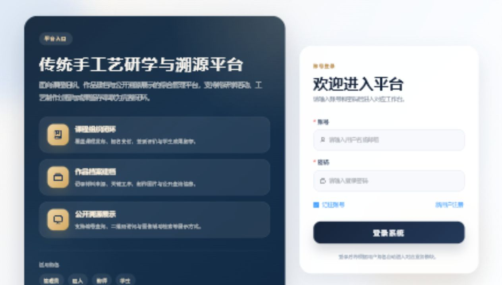
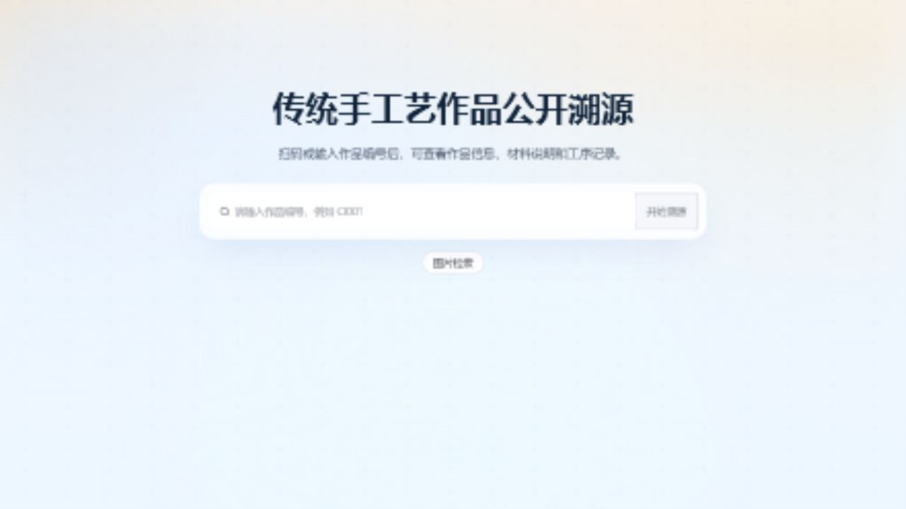

# 传统手工艺研学与溯源平台

> Spring Boot + Vue 3 Graduation Project


这是一个基于 Spring Boot + Vue 3 的毕业设计项目，聚焦传统手工艺研学、课程管理、作品展示与公开溯源查询。

## 项目亮点

- 面向毕业设计完整落地，前后端、数据库、权限、业务流程一体化实现
- 覆盖多角色场景，包括管理员、匠人/非遗传承人、教师、学生
- 支持课程发布、报名、订单、签到、评价、作品展示等完整业务闭环
- 提供公开溯源查询与图像相似辅助检索，强化“非遗数字化展示”主题
- 适合放入作品集、简历或复试材料，便于展示工程能力与产品思维

## 界面预览

### 登录页



### 公开溯源查询



### 图像相似辅助检索


## 功能模块

### 用户与权限

- 用户注册、登录、个人资料维护
- 管理员、学生、匠人等角色权限控制
- 登录状态校验与前端路由守卫

### 课程与研学

- 课程发布、课程详情、课程报名
- 订单支付、退款、签到、评价
- 我的课程、课程预约、课程考勤与评论管理

### 非遗工坊与资源管理

- 工坊、教师、学生、匠人、材料管理
- 作品展示与工艺品信息维护
- 溯源步骤录入、维护与可视化展示

### 公开展示与检索

- 面向游客的公开溯源查询页
- 图像相似辅助检索页面
- 适合用于非遗作品展示与传播场景

## 技术架构

### 前端

- Vue 3
- Vite
- Vue Router
- Pinia
- Element Plus
- Axios
- ECharts
- `qrcode.vue`
- `xlsx`

### 后端

- Spring Boot 2.7
- Spring Data JPA
- MySQL 8
- Maven
- Java 17

### 工程结构

```text
traditional-craft-trace-platform/
├─ src/                               Vue 前端源码
├─ public/                            前端静态资源与演示图片
├─ docs/screenshots/                  README 展示截图
├─ IdeaProjects（后端）/craft-trace/   Spring Boot 后端项目
├─ demo_refresh_utf8.sql              示例数据修正脚本
├─ package.json                       前端依赖与脚本
├─ vite.config.js                     Vite 配置
└─ README.md
```

## 快速开始

### 1. 环境要求

- Node.js 18+
- npm
- Java 17
- Maven 3.9+
- MySQL 8

### 2. 初始化数据库

```sql
CREATE DATABASE craft_trace DEFAULT CHARACTER SET utf8mb4;
```

### 3. 配置后端数据库

后端配置文件位于：

`IdeaProjects（后端）/craft-trace/src/main/resources/application.properties`

支持通过环境变量覆盖数据库配置：

- `DB_URL`
- `DB_USERNAME`
- `DB_PASSWORD`

PowerShell 示例：

```powershell
$env:DB_URL="jdbc:mysql://localhost:3306/craft_trace?useSSL=false&serverTimezone=Asia/Shanghai&characterEncoding=utf8"
$env:DB_USERNAME="root"
$env:DB_PASSWORD="你的数据库密码"
```

### 4. 启动后端

```bash
cd "IdeaProjects（后端）/craft-trace"
mvn spring-boot:run
```

说明：

- 项目启用了 `spring.jpa.hibernate.ddl-auto=update`
- 首次启动会自动创建或更新表结构
- 后端包含部分演示数据初始化逻辑

### 5. 启动前端

```bash
npm install
npm run dev
```

默认开发地址：

- `http://127.0.0.1:5173`

## 前端环境变量

开发环境配置文件：

- `.env.development`
- `.env.example`

主要变量说明：

- `VITE_DEV_HOST`：前端开发服务器监听地址
- `VITE_DEV_PORT`：前端开发服务器端口
- `VITE_API_TARGET`：Vite 代理到的后端地址
- `VITE_FILE_BASE_URL`：上传文件的绝对访问前缀，可留空
- `VITE_PUBLIC_ORIGIN`：公开分享链接使用的前端地址，可留空

## 常用命令

```bash
npm run dev
npm run build
npm run preview
npm run lint
```

后端启动：

```bash
mvn spring-boot:run
```

## 项目说明

- 当前仓库同时包含前端与后端代码，适合直接作为毕业设计完整工程归档
- `public/images/` 中保留的是项目演示资源，不属于缓存文件
- `demo_refresh_utf8.sql` 用于补充或修正部分演示数据
- 仓库已移除运行时上传文件、手工调试页和无用脚手架残留

## 后续可扩展方向

- 增加部署文档与线上演示地址
- 增加系统流程图、数据库 ER 图与接口说明
- 完善测试用例、接口鉴权与文件存储策略
- 针对简历展示补充业务背景、个人职责与开发总结

## License

本项目采用 [MIT License](LICENSE) 开源。
